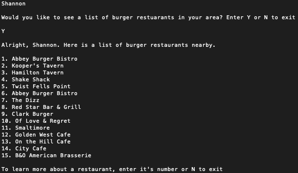
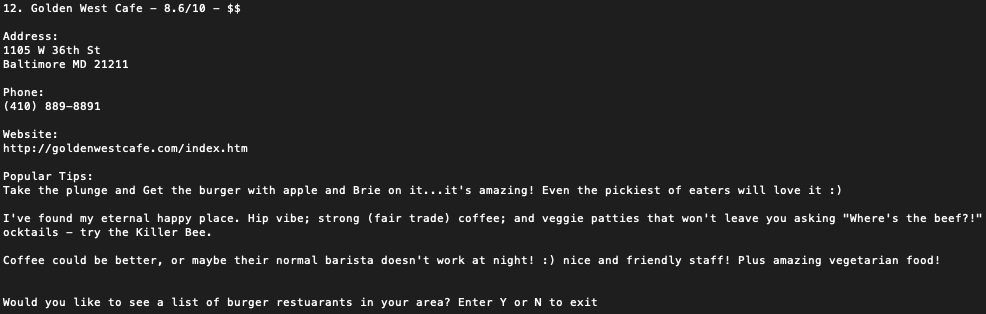
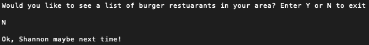

# Burger Finder

A CLI application built with Ruby to help you find the best burger joints in the Baltimore area. Yum!

🍔🍔🍔🍔🍔

## About

I like burgers. And I like to know where the best ones are in my area at all times. So, I build a Ruby application to do that.

The Ruby objects for each restaurant are scraped using Nokigiri from the webpage [The 15 Best Places for Burgers in Baltimore](https://foursquare.com/top-places/baltimore/best-places-burgers). Details on a specific restaurant is displayed based on a selection from the user.

My blog post [CLI Have No Idea What I’m Doing: Planning (and Building) My First CLI Application](https://shannoncrabill.com/blog/cli-application-planning/) goes into detail on the steps I took to make this happen.

A static version of the webpage is included in the `fixture` file to prevent any time out or repeated request errors.

***

## Usage

- `git clone https://github.com/scrabill/burger_finder.git`
- `cd burger_finder`
- `ruby bin/start` or `./bin/start` will start the program
- The CLI will ask you for you name and present a list of 15 burger joints in the Batimore area.

- Entering the number next to a restaurants name will show more details about that restaurant, including address, phone number, website and popular tips

- Entering "N" will exit the program. 

## Contributing

Bug reports are welcome on GitHub at https://github.com/scrabill/burger_finder. This project is intended to be a safe, welcoming space for collaboration, and contributors are expected to adhere to the [Contributor Covenant](http://contributor-covenant.org) code of conduct.

## Future Enhancements

- Implement an API for restaurant data
- Display data based on user input for location (city or zip code)
- ~~Better logic for edge cases (invalid input, etc)~~
- Error handling
- Save restaurant details into object after first call
- Update user agent and URL for initial scrap
- [Colorize](https://github.com/fazibear/colorize)
- Add emojis

## License

The app is available as open source under the terms of the [MIT License](https://opensource.org/licenses/MIT).

## Code of Conduct

Everyone interacting in the Install project’s codebases, issue trackers, chat rooms and mailing lists is expected to follow the [code of conduct](https://github.com/scrabill/install/blob/master/CODE_OF_CONDUCT.md).
